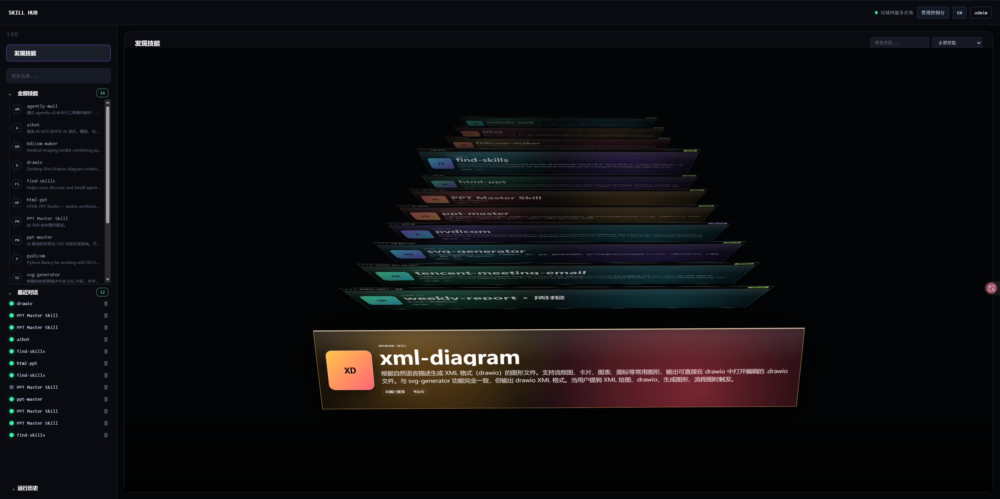
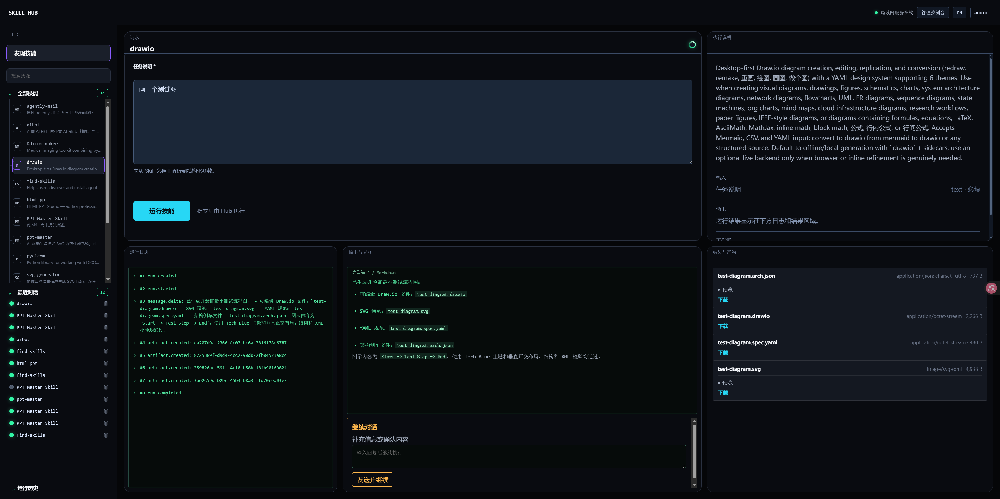
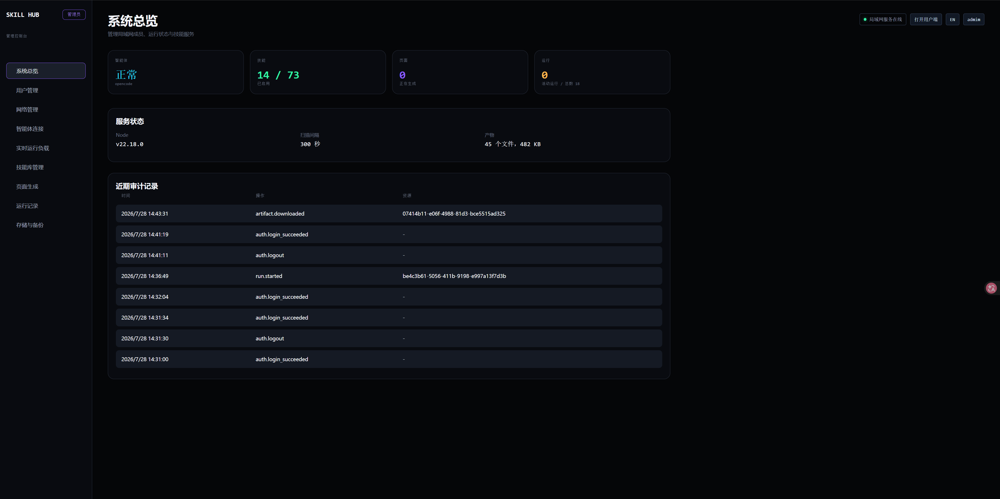

# OpenSkillHub

OpenSkillHub 是一个面向桌面和局域网的 OpenCode Skill 使用平台。它将本机 OpenCode 发现到的 Skill 同步到可视化技能库，为每个 Skill 提供可操作的工作区，并将运行日志、对话、Markdown 输出和产物集中展示。局域网用户只需浏览器和 Hub 账号，无需自行安装或配置 OpenCode、模型或 Skill。

> 当前项目以桌面端体验为目标，默认界面语言为中文。

## 主要能力

- 扫描 OpenCode 可发现的 Skill，并维护技能启用状态与页面生成状态。
- 使用预设提示词驱动 OpenCode 为 Skill 生成页面，生成结果持久化到 `frontend/generated/`，下次打开无需重新生成。
- 为用户提供技能卡片、技能工作区、实时运行事件、持续对话、Markdown 输出与产物下载。
- 将运行记录、上传文件和产物按用户隔离；管理员可查看审计、运行、存储和服务状态。
- 提供管理员控制台：用户与角色、Skill 库、页面生成、OpenCode 健康检查、运行记录、备份与清理。
- Hub 可监听局域网地址；OpenCode 保持在本机回环地址，浏览器不会直接访问 OpenCode。

## 界面预览

### 用户端：技能总览



### 用户端：技能工作区



### 管理端



## 架构与访问边界

```text
局域网浏览器
      |
      v
OpenSkillHub (Node / Fastify, 0.0.0.0:5180 或 HTTPS 反向代理)
      |
      v
OpenCode (仅本机 127.0.0.1:4197)
      |
      v
模型、Skill、运行工作区与产物
```

Hub 是唯一允许对局域网开放的服务。不要将 OpenCode 监听到 `0.0.0.0`，也不要把其端口做端口映射或反向代理给局域网用户。

## 环境要求

- Windows 10/11 或兼容 Node 的桌面/服务器环境。
- [Node.js](https://nodejs.org/) `22.18.0` 或更高版本。
- 已可在 Hub 主机上运行的 OpenCode，并已配置可用模型。
- npm（随 Node.js 安装）。

确认版本：

```powershell
node --version
npm --version
opencode --version
```

## 快速开始（本机开发）

以下命令均在本目录执行：

```powershell
cd <项目目录>
npm.cmd install
Copy-Item .env.example .env
```

### 1. 配置 `.env`

至少确认以下配置与本机 OpenCode 一致。可直接修改 `.env`；该文件包含账号和服务地址，不应提交到版本控制。

```dotenv
# Hub 对外服务地址。开发和局域网测试可使用 0.0.0.0。
HUB_HOST=0.0.0.0
HUB_PORT=5180

# 使用已经启动的 OpenCode 服务。
OPENCODE_MODE=connect
OPENCODE_URL=http://127.0.0.1:4197
OPENCODE_WORKING_DIRECTORY=.

# 只有同时设置 provider 与 model 时，Hub 才会显式指定模型。
OPENCODE_MODEL_PROVIDER=<你的模型供应商标识>
OPENCODE_MODEL_ID=<你的模型标识>
OPENCODE_MODEL_VARIANT=<可选模型变体>

# 首次创建数据库时的引导账号。请自行设置唯一的强凭据。
HUB_ADMIN_USERNAME=<管理员用户名>
HUB_ADMIN_PASSWORD=<管理员强密码>
HUB_INITIAL_USER_USERNAME=<首个普通用户名>
HUB_INITIAL_USER_PASSWORD=<普通用户强密码>
HUB_PASSWORD_MIN_LENGTH=12
```

引导账号只会在**空数据库首次启动**时创建。若数据库已存在，修改 `.env` 中的账号密码不会重置现有账号；请使用管理员的用户管理功能修改，或按团队的数据保留策略执行受控的账号恢复。局域网发布前请使用唯一的强密码，并将 `HUB_PASSWORD_MIN_LENGTH` 保持在至少 `12`。

### 2. 启动 OpenCode

在新的 PowerShell 窗口启动 OpenCode，并将它只绑定到本机：

```powershell
opencode serve --hostname 127.0.0.1 --port 4197
```

保持该终端窗口运行。可以通过以下命令确认 OpenCode 健康状态：

```powershell
Invoke-RestMethod http://127.0.0.1:4197/global/health
```

如果你的 OpenCode 已运行在其他端口，只需相应修改 `OPENCODE_URL`。管理员控制台的“提供商/健康检查”也可验证 Hub 是否成功连接。

### 3. 启动 Hub

在另一个 PowerShell 窗口执行：

```powershell
cd <项目目录>
npm.cmd run dev
```

浏览器打开 [http://127.0.0.1:5180/login](http://127.0.0.1:5180/login)。如果 `.env` 使用的是其他 `HUB_PORT`，请替换端口。

`npm run dev` 使用监听模式，修改 TypeScript 服务端代码后会自动重启。修改 `.env` 后也应重启 Hub。

## 使用流程

### 管理员流程

1. 用管理员账号登录，进入 `/admin`。
2. 在“提供商”检查 OpenCode 是否健康；若离线，先确认 OpenCode 进程、端口和 `OPENCODE_URL`。
3. 在“技能库管理”执行扫描。系统会同步可发现的 Skill。
4. 启用允许用户使用的 Skill。系统会为启用且缺少页面的 Skill 自动排队生成操作页面；也可在管理端手动重新生成或启用某个版本。
5. 在“用户管理”创建普通用户，按需要调整角色、启用状态和密码。
6. 在“运行记录、审计、存储”查看运行情况，按需创建备份或清理过期产物。

### 普通用户流程

1. 用普通账号登录，进入技能中心。
2. 从“全部技能”选择已启用的 Skill，或在“最近对话/运行历史”恢复查看过往任务。
3. 在技能工作区填写参数、上传文件或选择操作后开始运行。
4. 在下方区域查看实时事件日志、模型的 Markdown 返回内容和生成产物。
5. 当 Skill 要求补充信息时，等待 OpenCode 首次返回后，在运行事件区域的对话输入框继续发送消息。
6. 在“最近对话”中可查看仍需跟进或刚刚完成的会话，并可使用关闭图标结束和删除会话。

## 构建与生产运行

开发完成后，先进行类型检查和构建：

```powershell
cd <项目目录>
npm.cmd run typecheck
npm.cmd run build
npm.cmd start
```

构建结果输出到 `dist/`，生产进程执行 `dist/server.js`。常用命令如下：

| 命令 | 用途 |
| --- | --- |
| `npm.cmd run dev` | 开发模式启动并监听 TypeScript 变更 |
| `npm.cmd run typecheck` | 运行 TypeScript 类型检查 |
| `npm.cmd run test` | 运行全部自动化测试 |
| `npm.cmd run test:api` | 运行 API 测试 |
| `npm.cmd run test:browser` | 运行浏览器冒烟检查 |
| `npm.cmd run build` | 编译生产版本到 `dist/` |
| `npm.cmd start` | 启动编译后的生产服务 |

生产环境建议使用独立终端、Windows 服务或进程管理器运行 `npm.cmd start`。更新代码后按顺序执行 `npm.cmd run build`，再重启 Hub 服务。

## 局域网部署

### 临时 HTTP 测试

1. 将 `.env` 设置为 `HUB_HOST=0.0.0.0`，并为 `HUB_PORT` 选择未占用端口，例如 `5180`。
2. 在 Hub 主机执行 `ipconfig`，记录其局域网 IPv4 地址，例如 `192.168.1.20`。
3. 以管理员身份打开 PowerShell，仅向私有网络放行 Hub 端口：

```powershell
New-NetFirewallRule -DisplayName "OpenSkillHub HTTP Test (Private)" -Direction Inbound -Action Allow -Protocol TCP -LocalPort 5180 -Profile Private
```

4. 启动 Hub 后，在另一台局域网设备上访问 `http://192.168.1.20:5180/login`。

临时 HTTP 只适合受控测试，不应传输真实账号、文件或生产数据。

### 推荐生产方式：HTTPS 反向代理

推荐在 Hub 主机使用 Caddy 或 Nginx 终止 HTTPS，并让 Node 仅监听回环地址：

```dotenv
HUB_HOST=127.0.0.1
HUB_PORT=5177
HUB_COOKIE_SECURE=true
```

以 Caddy 为例，局域网 DNS 已将 `skillhub.lan` 指向 Hub 主机时，可使用：

```caddyfile
https://skillhub.lan {
    tls internal
    reverse_proxy 127.0.0.1:5177
}
```

然后只在 Windows 私有网络中放行 HTTPS：

```powershell
New-NetFirewallRule -DisplayName "OpenSkillHub HTTPS (Private)" -Direction Inbound -Action Allow -Protocol TCP -LocalPort 443 -Profile Private
```

局域网客户端需要信任 Caddy 的内部 CA，随后通过 `https://skillhub.lan/login` 使用服务。绝不要为 `4197` 等 OpenCode 端口创建防火墙规则或反向代理。

更多发布细节见 [docs/lan-deployment.md](docs/lan-deployment.md)。

## 注册为 Windows 服务

项目提供 Windows 服务安装脚本。先在项目目录构建，然后以管理员 PowerShell 执行：

```powershell
cd <项目目录>
npm.cmd run build
Set-ExecutionPolicy -Scope Process Bypass
.\scripts\install-hub-service.ps1 -ProjectRoot "<项目目录>"
```

查看与重启服务：

```powershell
Get-Service OpenSkillHub
Restart-Service OpenSkillHub
```

卸载服务：

```powershell
Stop-Service OpenSkillHub
sc.exe delete OpenSkillHub
```

OpenCode 的启动策略独立于 Hub。使用 `OPENCODE_MODE=connect` 时，请确保 OpenCode 已作为独立进程或服务启动；详见后文的运行模式。Windows 服务部署说明见 [docs/windows-service.md](docs/windows-service.md)。

## OpenCode 连接方式

### `connect`：连接已有 OpenCode（推荐）

这是当前默认方式。你自行启动 OpenCode，Hub 只连接 `OPENCODE_URL`：

```dotenv
OPENCODE_MODE=connect
OPENCODE_URL=http://127.0.0.1:4197
```

优点是 OpenCode 的模型登录、配置和日志完全由你管理，Hub 重启不会中断外部管理的 OpenCode 进程。

### `managed`：由 Hub 管理 OpenCode

此方式由 Hub 启动 `OPENCODE_COMMAND` 和 `OPENCODE_ARGS_JSON` 指定的命令：

```dotenv
OPENCODE_MODE=managed
OPENCODE_COMMAND=opencode
OPENCODE_ARGS_JSON=["serve","--hostname","127.0.0.1","--port","4197"]
OPENCODE_URL=http://127.0.0.1:4197
```

仍应保持 `--hostname 127.0.0.1`。切换运行方式前请停止占用同一端口的 OpenCode 进程，并重启 Hub。

## Skill 发现与页面生成

默认情况下 Hub 通过 OpenCode API 发现 Skill：

```dotenv
OPENCODE_API_SKILL_DISCOVERY=true
```

如需额外限制允许扫描的本地目录，可设置 JSON 数组。路径会相对于项目目录解析：

```dotenv
OPENCODE_SKILL_ROOTS_JSON=["<Skill目录一>","<Skill目录二>"]
```

系统也会按 `SKILL_SYNC_INTERVAL_MS` 定期同步（默认 5 分钟）。管理员手动扫描后，已启用且尚未生成页面或页面提示词版本过期的 Skill 会进入生成队列。页面生成临时文件位于 `HUB_PAGE_GENERATION_TEMP_ROOT`，经过验证后保存到 `frontend/generated/`。

不要手动修改运行中的生成页面或数据库；需要重新设计时，请在管理控制台对目标 Skill 使用页面生成操作，并在生成完成后激活对应版本。

## 数据、备份与恢复

- SQLite 数据库位置由 `HUB_DATA_PATH` 控制。
- 生成的 Skill 页面位于 `frontend/generated/`。
- OpenCode 托管运行时文件位于 `runtime/`。
- 管理端“存储”页面可以创建受控备份，其中包括数据库和已生成页面；备份位于 `data/backups/`，不应提交到 Git。
- 恢复数据库或页面前必须先停止 Hub，并先备份当前 `data/*.db` 与 `frontend/generated/`。恢复不会覆盖当前 `.env` 中的密码和 OpenCode 配置。

详见 [docs/backup-recovery.md](docs/backup-recovery.md)。

## 配置速查

| 配置项 | 作用 | 建议 |
| --- | --- | --- |
| `HUB_HOST` / `HUB_PORT` | Hub 监听地址和端口 | 开发可用 `0.0.0.0:5180`；HTTPS 代理时改为 `127.0.0.1:5177` |
| `OPENCODE_MODE` | `connect` 或 `managed` | 优先 `connect` |
| `OPENCODE_URL` | OpenCode 本机地址 | 保持 `http://127.0.0.1:<port>` |
| `OPENCODE_MODEL_PROVIDER` / `OPENCODE_MODEL_ID` | 显式选择模型 | 两项必须同时填写，或同时留空使用 OpenCode 默认值 |
| `HUB_ADMIN_*` | 首次管理员账号 | 局域网部署前使用强密码 |
| `HUB_INITIAL_USER_*` | 首次普通用户账号 | 可选；只在空库时创建 |
| `HUB_AUTH_REQUIRED` | 是否强制登录 | 局域网始终保持 `true` |
| `HUB_COOKIE_SECURE` | Cookie 仅通过 HTTPS 发送 | HTTPS 反向代理时设为 `true` |
| `HUB_PASSWORD_MIN_LENGTH` | 用户密码最小长度 | 局域网建议至少 `12` |
| `HUB_MAX_CONCURRENT_RUNS_PER_USER` | 单用户并行运行上限 | 按模型/机器资源调整 |
| `HUB_ARTIFACT_RETENTION_DAYS` | 产物清理期限 | 定期检查存储后执行清理 |
| `HUB_HIGH_RISK_SKILL_IDS_JSON` | 每次运行须显式确认的 Skill ID 列表 | 将高风险操作加入此列表 |

完整示例见 [.env.example](.env.example)。

## 健康检查与排障

### Hub 是否启动

```powershell
Invoke-RestMethod http://127.0.0.1:5180/api/health
```

若返回 `service: "open-skill-hub"`，说明 Hub HTTP 服务正常。

### 管理端显示 OpenCode 离线

按以下顺序检查：

1. 执行 `opencode serve --hostname 127.0.0.1 --port 4197`，确认进程仍在运行。
2. 执行 `Invoke-RestMethod http://127.0.0.1:4197/global/health`。
3. 确认 `.env` 中 `OPENCODE_URL` 与实际端口一致。
4. 修改 `.env` 后重启 Hub。
5. 在管理员控制台重新执行 OpenCode 健康检查，必要时查看提供商日志。

### 登录提示账号或密码无效

- 账号仅在空数据库时由 `.env` 初始化；已经创建过数据库时，不能通过修改 `.env` 重置。
- 管理员可以在“用户管理”中重置其他用户密码。
- 若管理员密码也已遗失，请先备份数据，再按团队的数据保留策略处理数据库；不要直接删除数据文件以重置密码。

### 局域网设备无法访问

1. 确认 Hub 主机和客户端处于同一可访问网段。
2. 确认 Hub 监听 `0.0.0.0`，或 Caddy/Nginx 正在监听 443。
3. 确认 Windows 防火墙仅在 `Private` 配置文件放行了目标端口。
4. 从客户端使用 `Test-NetConnection <Hub-IP> -Port <端口>` 测试连通性。
5. 不要将 OpenCode 的端口开放给客户端。

### 常用日志位置

- 使用 `npm.cmd run dev` 时，日志直接输出在启动 Hub 的终端。
- Hub 托管 OpenCode 时，OpenCode 日志写入 `runtime/logs/opencode.log`。
- 用户运行的实时事件、模型输出和产物可在对应 Skill 工作区查看。

## 上线前检查清单

- [ ] 管理员和初始用户已改为独立强密码。
- [ ] `HUB_AUTH_REQUIRED=true`。
- [ ] OpenCode 只监听 `127.0.0.1`。
- [ ] 已验证至少一个普通用户可运行 Skill、查看输出并下载自己的产物。
- [ ] 已验证不同用户不能查看彼此的运行记录和产物。
- [ ] 已验证管理员可查看健康状态、审计和备份。
- [ ] 已使用 HTTPS 或明确限制在临时受控 HTTP 测试环境。
- [ ] Windows 防火墙只开放私有网络所需的 Hub 端口。

## 相关文档

- [局域网发布说明](docs/lan-deployment.md)
- [Windows 服务部署](docs/windows-service.md)
- [备份与恢复](docs/backup-recovery.md)
- [旧服务迁移说明](docs/migration-m7.md)
